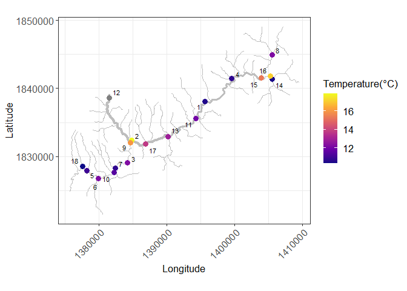

<!-- README.md is generated from README.Rmd. Please edit that file -->

# SSNdata

<!-- badges: start -->
<!-- badges: end -->

**Spatio-temporal stream network datasets**

This is a companion package to SSNbayes. It contains a spatial stream
network object from the Clearwater River basin, USA and some water
temperature datasets. It consists of 18 spatial obervation and 60
prediction locations.

## Installation

You can install the development version of SSNdata from
[GitHub](https://github.com/) with:

``` r
# install.packages("devtools")
devtools::install_github("EdgarSantos-Fernandez/SSNdata")
```

## Example

This is a basic example of how to use the data from the package:

``` r
library('lubridate')
library('ggrepel')
library('RColorBrewer')
library('SSN')
library('SSNbayes')
library('SSNdata')
```

``` r
path <- system.file("extdata/clearwater.ssn", package = "SSNdata")
n <- importSSN(path, predpts = "preds", o.write = TRUE)

## Import data.frame containing observations and covariates
clear <- readRDS(system.file("extdata/clear_obs.RDS", package = "SSNdata"))


# Plotting the stream network 
clear.df <- SSNbayes::collapse(n, par = 'afvArea')
clear.df$addfunccol_cat <- cut(clear.df$afvArea,
                               breaks = seq(min(clear.df$afvArea),
                                            max(clear.df$afvArea),
                                            length.out=5),
                               labels = 1:4,
                               include.lowest = T)
col <- 'gray'

ggplot(clear.df) +
  geom_path(aes(X1, X2, group = slot, size = addfunccol_cat), lineend = 'round', linejoin = 'round', col = col)+
  geom_point(data = dplyr::filter(clear, clear$date == ymd('2012-08-01')) ,
             aes(x = UTM_Xcoord, y = UTM_Ycoord, col = temp), size = 3)+
  geom_text_repel(data = dplyr::filter(clear, clear$date == ymd('2012-08-01')),
                  aes(x = UTM_Xcoord, y = UTM_Ycoord, label = locID),size = 3)+
  scale_size_manual(values = seq(0.2,2,length.out = 5))+
  scale_color_viridis_c(option = 'C')+
  scale_shape_manual(values = c(16))+
  ylab("Latitude") +
  xlab("Longitude")+
  coord_fixed()+
  theme_bw()+
  guides(size = 'none')+
  labs(size="",colour = "Temperature(°C)")+
  theme(axis.text=element_text(size=12),
        axis.title=element_text(size=13),
        legend.text=element_text(size=13),
        legend.title=element_text(size=13),
        axis.text.x = element_text(angle = 45, hjust=1),
        strip.background =element_rect(fill='white'))
```


